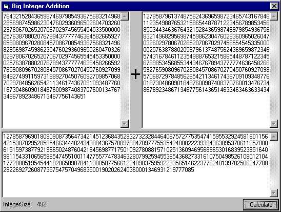



## Very Big Integer Addition

### Description

This code calculates an huge Integer (I don't know how big, because system crashed at copy & paste). It works with strings so the Number can be bigger than double and so on...
 
### More Info
 

             |
---                |---
**Submitted On**   |2002-08-16 15:56:04
**By**             |[Michele Wolter](https://github.com/Planet-Source-Code/PSCIndex/blob/master/ByAuthor/michele-wolter.md)
**Level**          |Intermediate
**User Rating**    |4.3 (13 globes from 3 users)
**Compatibility**  |VB 5\.0, VB 6\.0
**Category**       |[Math/ Dates](https://github.com/Planet-Source-Code/PSCIndex/blob/master/ByCategory/math-dates__1-37.md)
**World**          |[Visual Basic](https://github.com/Planet-Source-Code/PSCIndex/blob/master/ByWorld/visual-basic.md)
**Archive File**   |[Big\_Intege1189128162002\.zip](https://github.com/Planet-Source-Code/michele-wolter-very-big-integer-addition__1-38008/archive/master.zip)

